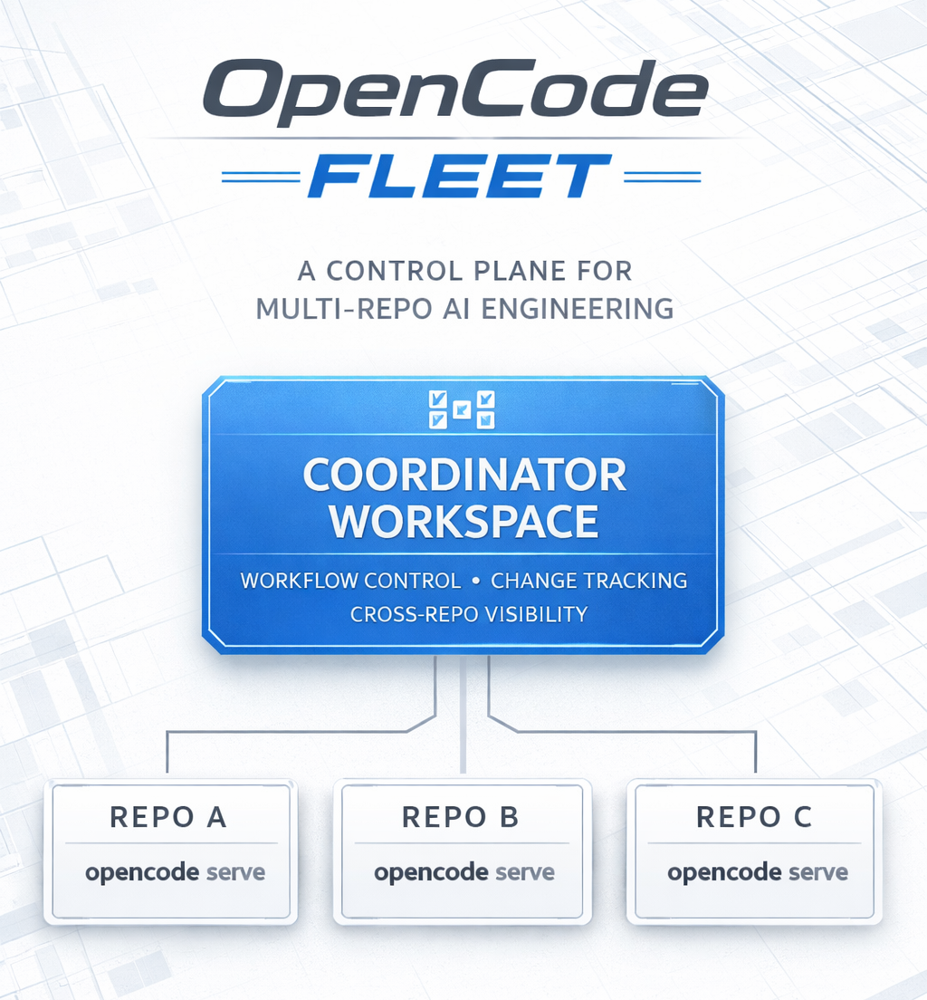

# OpenCode Fleet

OpenCode Fleet is a coordinator workspace for multi-repo OpenCode execution.

The intended user experience is simple: start `opencode` in this folder, describe the cross-repo change in plain language, and let the coordinator drive the impacted repositories in the right order.



## What it does

- Keeps one `opencode serve` instance per repository
- Tracks workflow session IDs per repo in `.fleet-state.json`
- Fans out impact-analysis prompts across all repos
- Sends repo-specific implementation prompts only where needed
- Keeps rollout notes in `change-tracker.md`

## Normal use

In normal use, the human does not call `fleet` commands directly.

Instead, the human starts OpenCode in this coordinator folder and says what should happen, for example:

```text
I have addition feature 1 and this will impact A, external API of A, and B.
Coordinate and implement the changes.
A runs on :4001, external API of A runs on :4002, and B runs on :4003.
B consumes A only through the external API.
The new interface should add customerSegment to the customer details response.
Keep the rollout backward compatible and update tests where needed.
```

The coordinator should then:

- choose or reuse a workflow key
- assess impact across the configured repos
- preserve one repo-local session per impacted repo
- implement in rollout order, such as `A -> external-api -> B`
- return one coordinated progress summary to the user

## Local setup

1. Install dependencies.

```bash
npm install
```

2. Copy the sample registry and point it at your real repositories.

```bash
cp repos.example.json repos.json
```

3. Set any password environment variables referenced by `repos.json`. You can copy values from `.env.example` into your shell or your preferred env loader.

```bash
export REPO_A_OPENCODE_PASSWORD=repo_a_secret
export REPO_EXTERNAL_API_OPENCODE_PASSWORD=external_api_secret
export REPO_B_OPENCODE_PASSWORD=repo_b_secret
```

4. Start one backend per target repository. Run each command from that repository's root.

```bash
OPENCODE_SERVER_PASSWORD="$REPO_A_OPENCODE_PASSWORD" opencode serve --port 4001
OPENCODE_SERVER_PASSWORD="$REPO_EXTERNAL_API_OPENCODE_PASSWORD" opencode serve --port 4002
OPENCODE_SERVER_PASSWORD="$REPO_B_OPENCODE_PASSWORD" opencode serve --port 4003
```

5. Start `opencode` in this coordinator workspace and describe the feature in natural language.

```bash
opencode
```

## Example scenario

Assume:

- `:4001` is repo A
- `:4002` is the external API for A
- `:4003` is repo B
- B talks to A only through the external API

If you ask the coordinator to add `customerSegment` to the customer details response, a good execution plan is:

- A adds the source field and internal mapping
- external API exposes the new field in a backward-compatible contract
- B consumes the field safely, with fallback behavior when absent

That is exactly the kind of cross-repo change this workspace is for.

## Project layout

- `src/fleet.ts` - internal orchestration engine used by the coordinator
- `repos.example.json` - public-safe template for your repo/server registry
- `repos.json` - local repo/server registry copied from the example file
- `.fleet-state.json` - generated workflow/session state
- `change-tracker.md` - human checklist for cross-repo work
- `shared-rules/` - OpenCode coordination rules for this workspace

## Advanced use

The `fleet` commands are still available for debugging, automation, or troubleshooting, but they are implementation details of the coordinator experience rather than the primary user workflow.

- `list` - list configured repos
- `status [workflow]` - show health for every repo and optional saved session IDs for a workflow
- `impact <workflow> <prompt>` - create or reuse one session per repo and request structured impact analysis
- `prompt <repo> <workflow> <prompt>` - continue one repo's workflow session with a free-form prompt

## Public repo notes

- Commit `repos.example.json`, not `repos.json`
- Keep passwords in environment variables only
- `.fleet-state.json`, `node_modules/`, and `dist/` stay local and are ignored
